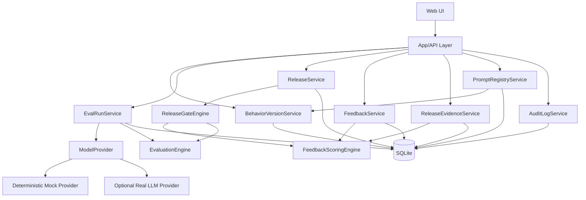

# AI Behavior Release Manager - Engineering Plan

## Product Thesis

AI behavior changes should be released like production code: versioned, evaluated, compared against the current baseline, reviewed, rolled out, and monitored.

This project is not a prompt playground. It is a small release-management system for AI behavior changes.

## One-Day Scope

The goal is to ship a polished, working vertical slice that demonstrates the full lifecycle:

```text
Create behavior version
-> run eval comparison
-> detect regressions
-> review release gate
-> promote to production
-> inspect feedback signals and audit history
```

## Success Metrics

The project succeeds if it demonstrates that an AI behavior change can be reviewed with the same discipline as a production code release: evidence, gates, rollback-minded thinking, and auditability.

### Product Success

- A reviewer can understand the current production behavior and a candidate behavior within 30 seconds.
- A reviewer can run an apples-to-apples eval comparison without external API keys.
- The system clearly distinguishes improvements, regressions, unchanged passes, and unchanged failures.
- The release gate blocks a candidate with a critical regression even if the aggregate score looks acceptable.
- The feedback score explains tradeoffs and warns on mixed signals rather than hiding them in one average.
- The audit timeline makes it clear who changed what, when, and why.

### Engineering Success

- Fresh-container setup works with only Python and no required network/API access.
- Seed data is deterministic and idempotent.
- Eval runs are reproducible.
- Candidate promotion is impossible with missing, stale, partial, or non-comparable eval evidence.
- Production promotion preserves the invariant that exactly one behavior version is production.
- Core release-gate and evaluator behavior is covered by tests.

### Demo Success

- The seeded risky candidate improves tone but triggers a policy/refund regression.
- The gate blocks the risky candidate with a human-readable reason.
- Editing or selecting a safer candidate causes the eval to pass.
- Promotion updates production and writes an audit event.
- The UI makes the failure path as understandable as the happy path.

### Non-Goals for Success

- It does not need real traffic ingestion.
- It does not need multi-tenant auth/RBAC.
- It does not need live LLM calls.
- It does not need high-scale eval execution in the MVP.

## In Scope

### 1. Behavior Version Management

Each behavior version represents a deployable AI configuration:

- name
- prompt
- model name
- temperature
- status: draft, needs_tuning, evaluated, qa_ab, approved, production, blocked, rejected
- created timestamp
- release notes

Core UI:

- list behavior versions
- view current production version
- create/edit a candidate version
- compare candidate against production
- promote candidate to production
- show a CI/CD-style behavior pipeline by status
- show which use cases each prompt is intended to protect

### 1.1 Behavior Release Pipeline

The UI should borrow the mental model of a CI/CD release pipeline. This makes prompt/model behavior changes easier for engineering teams to reason about.

Pipeline stages:

```text
Candidate Pool
  -> Evaluation
  -> Local A/B Simulation
  -> QA / A-B Test
  -> Production Canary 10%
  -> Production Ramp 50%
  -> Production 100%
```

Failure lanes:

```text
Needs Tuning
Blocked
Rejected
```

Stage meanings:

| Stage | Meaning | Typical next action |
| --- | --- | --- |
| Candidate Pool | Draft prompts and model configs not yet trusted | Run eval |
| Evaluation | Candidate is being compared against production | Review eval results |
| Local A/B Simulation | Candidate is compared with seeded/simulated feedback before deployment | Decide whether it is worth QA |
| Needs Tuning | Good direction, but warnings or low-confidence issues remain | Follow path-to-green advice |
| QA / A-B Test | Passed offline gate and is deployed to test fixtures with a holdout-style comparison | Run QA checks and scenario replay |
| Production Canary 10% | Small production rollout with guardrails | Continue, hold, or rollback |
| Production Ramp 50% | Wider rollout after canary remains healthy | Continue, hold, or rollback |
| Production 100% | Current live behavior for all traffic | Monitor feedback and audit history |
| Blocked | Critical/stale/partial/non-comparable evidence | Cannot promote; fix and rerun |
| Rejected | Human decision not to ship | Preserve audit trail |

Core UI:

- pipeline board with one column per stage
- cards for each behavior version
- each card shows protected use case, gate state, latest score, and red flags
- red flags for critical regressions, stale evals, non-comparable runs, worse pass rate, or mixed high-risk feedback
- "path to green" suggestions for candidates that are promising but not ready
- one-screen process visibility: the reviewer should see where a prompt is, why it is there, and what action is possible without reading docs
- scenario coverage indicators showing which happy-path and failure-path eval cases were exercised

MVP interpretation:

A/B Signals and production rollout metrics are seeded/simulated feedback signals, not a real traffic router. The UI should make that clear. Real traffic routing is a future scalability/infrastructure step.

### 1.2 Environment Promotion and Progressive Rollout

The release button should not be a single jump from eval to production. It should behave like a pipeline action whose label depends on the current stage.

Pipeline actions:

```text
Candidate Pool -> Run Evaluation
Evaluation -> Run Local A/B Simulation
Local A/B Simulation -> Submit to QA / A-B
QA / A-B -> Start production canary at 10%
Production Canary 10% -> Ramp to 50%
Production Ramp 50% -> Ramp to 100%
Any active stage -> Hold, rollback, or reject
```

Why:

Offline evals, local A/B simulation, and QA are necessary but not sufficient. Production can behave differently because of real traffic mix, provider latency, retrieval freshness, tool availability, user distribution, or hidden product coupling.

Environment semantics:

- Local A/B Simulation: seeded/simulated comparison inside the release manager; no deployment.
- QA / A-B Test: candidate is deployed to a test server or fixture environment with a holdout-style comparison; still no customer traffic.
- Production rollout: candidate receives real production traffic through progressive ramp.

Monitoring expectations:

- QA and production both continue monitoring health after promotion.
- QA monitoring checks scenario replay, fixture behavior, and environment-specific integration drift.
- Production monitoring compares candidate cohort against holdout and can hold or rollback.

Progressive rollout guardrails:

- compare candidate cohort against production holdout group
- monitor pass-rate proxy, thumbs-down rate, retry rate, escalation rate, complaint tags, latency, and cost
- hold rollout if warning thresholds are crossed
- automatically rollback if hard guardrails are crossed
- require human review for high-risk use cases before increasing rollout percentage
- write audit event for every stage transition

Example rollout policy:

```text
10% canary:
  hold if thumbs_down_rate worsens by > 3 percentage points
  rollback if escalation_rate worsens by > 5 percentage points

50% ramp:
  require no critical complaint-tag increase
  require candidate feedback score >= holdout feedback score

100% promotion:
  require stable metrics over the observation window
  preserve previous production version for rollback
```

Rollback behavior:

- rollback from 10% or 50% returns traffic to previous production
- rollback from QA / A-B returns candidate to Candidate Pool or Needs Tuning
- rollback reason is required
- rollback preserves eval runs, rollout metrics, and audit history

MVP scope:

The MVP can represent these stages and guardrails with metadata and seeded/simulated rollout signals. It should not build a real production router.

### 1.3 Release Decision UX Contract

The UI should not make the reviewer infer the release process. Every behavior version should land in one of three decision colors with explicit next steps.

#### Green: Ready or Auto-Promote Eligible

Meaning:

- all required eval scenarios passed
- no critical or high-severity regressions
- candidate pass rate is at least production pass rate
- apples-to-apples comparison is valid
- feedback score is acceptable
- no mixed high-risk feedback signals

Action:

- for low-risk use cases, mark as auto-promote eligible
- for high-risk use cases, show one-click promote with human approval
- write audit history either way

Staff-level nuance:

Do not blindly auto-promote every green prompt. Auto-promotion should require an explicit release policy, low-risk use cases, complete test coverage, and valid comparison metadata. For the MVP, showing "auto-promote eligible" is safer than silently promoting.

#### Risk Classification

Risk should not be based on one signal. High relevance to existing production behavior lowers uncertainty, but it does not automatically mean low risk. A refund-policy prompt can be very similar to production and still be high impact if it changes eligibility language.

MVP heuristic:

```text
high risk if:
  use case has critical or high severity eval coverage
  tags include safety, policy, refund, medical, legal, billing, privacy, or security
  candidate changes model, temperature, tool use, or retrieval behavior
  candidate reduces pass rate for any protected use case
  feedback shows high-risk mixed signals

low risk if:
  use case is low/medium severity
  tags are tone, formatting, or copy style
  candidate is highly similar to production behavior
  all protected evals pass
  no high-risk feedback signals worsen
```

Production relevance signal:

```text
production_relevance =
  similarity(candidate_prompt, production_prompt)
  + overlap(candidate_use_cases, production_use_cases)
  + historical_pass_rate_for_same_feature
```

How to use it:

- high production relevance can make a candidate lower uncertainty
- high severity can still keep the candidate high risk
- low production relevance means the candidate should not be auto-promoted even if initial evals pass

Auto-promote eligibility:

```text
auto_promote_eligible =
  gate_state == "pass"
  and risk_level == "low"
  and scenario_coverage_complete
  and apples_to_apples_comparison_valid
  and release_policy_allows_auto_promote
```

Future scalability:

For the MVP, risk can be rule-based from tags, severity, and config diffs. Later, risk should become a dedicated policy engine that incorporates production traffic volume, customer tier, incident history, semantic similarity, rollout blast radius, and historical eval reliability.

#### Yellow: Good Direction, Needs Tuning

Meaning:

- no hard blockers
- candidate improves or matches important behavior
- some warnings remain, such as mixed feedback, low-confidence use case coverage, minor formatting failures, or high-severity warning without critical regression

Action:

- keep in Candidate Pool or Needs Tuning lane
- show exact failed/warned cases
- show path-to-green advice tied to the prompt/eval evidence
- allow reviewer override only with a reason
- if reviewer does not override, candidate stays available for editing and rerun

Path-to-green advice examples:

```text
Refund policy warning:
  Add explicit "30 days" and "support escalation" language.

Tone warning:
  Candidate is correct but cold. Add empathy language while preserving policy.

Mixed feedback:
  Thumbs-up improved, but escalation worsened. Inspect policy_confusion and refund complaint tags.

Formatting warning:
  Add bullet structure for policy summaries.
```

#### Red: Blocked

Meaning:

- critical regression
- stale eval
- partial/failed eval
- non-comparable provider/eval-suite metadata
- candidate pass rate below production
- safety/policy red flag

Action:

- disable promotion
- show exact blocking reasons
- link to failed cases and generated outputs
- require edit and rerun or reject
- write release_blocked or version_rejected audit event

#### Test Coverage Visibility

The UI should show whether the eval suite covered the expected scenarios:

- happy path: safe candidate passes and can promote
- critical regression: risky candidate blocks
- warning path: promising candidate needs tuning
- stale eval: candidate edited after eval disables promotion
- non-comparable eval: provider/eval suite mismatch blocks
- feedback conflict: mixed high-risk signals warn
- reject path: reviewer rejects and audit records it
- override path: reviewer promotes yellow candidate with reason

This turns tests into product evidence. The reviewer can see not only the score, but which release scenarios were exercised.

### 2. Eval Case Management

Eval cases represent known behaviors the team cares about.

Each case includes:

- user input
- expected behavior
- tags: policy, refund, tone, formatting, safety, etc.
- must-include phrases
- must-not-include phrases
- severity: low, medium, high, critical

Core UI:

- seeded eval suite
- view eval cases
- add/edit a simple eval case if time allows

### 3. Offline Eval Runs

Run production and candidate behavior against the same eval suite.

For each case:

- generate production output
- generate candidate output
- score production output
- score candidate output
- classify result:
  - improved
  - regressed
  - unchanged pass
  - unchanged fail
- store judge reason

Core UI:

- run eval comparison
- show summary counts
- show case-by-case diff
- filter by regression / improved / tag / severity

### 4. Release Gate

A release gate gives the reviewer a fast go/no-go decision.

Example rules:

- block release if any critical regression exists
- warn if high-severity regressions exist
- require candidate pass rate >= production pass rate
- warn if estimated cost or latency worsens
- show user feedback deltas if available

Core UI:

- release gate card
- pass/warn/block state
- human-readable reasons
- approve / reject action

### 5. User Feedback Signals

Feedback is modeled as production signal, not as the only source of truth.

Feedback dimensions:

- thumbs up rate
- thumbs down rate
- escalation rate
- retry rate
- top complaint tags

Core UI:

- feedback panel by behavior version
- compare feedback between production and candidate
- attach feedback by tag

This is intentionally seeded/simulated for the MVP. The goal is to show how feedback would influence release decisions.

### 6. Audit History

Every important change should create an audit event:

- behavior version created
- eval run completed
- release gate passed/blocked
- version promoted
- version rejected

Core UI:

- audit timeline
- who/what/when/why

## Out of Scope

These are intentionally excluded from the one-day build.

### Real Multi-Tenant Auth

No auth, organizations, RBAC, or user management.

Why:

Authentication does not prove the core product thesis. It would consume time without improving the release-management workflow.

### Real Live Traffic Routing

No actual production A/B router.

Instead:

- model environment and rollout stage as metadata
- show QA / A-B, canary, ramp, and production stages
- show holdout comparison and rollout guardrails using seeded/simulated signals
- include feedback signals as seeded/simulated production metrics
- support rollback semantics in the product model, even if no real traffic is moved

Why:

The important judgment is understanding rollout safety. A full router would be infrastructure-heavy and unnecessary for a one-day slice, but the system should still show how safe rollout would be governed.

### Full LLM Provider Abstraction

No broad provider matrix.

Build:

- deterministic mock provider by default
- optional real LLM provider only if API key exists

Why:

The reviewer must be able to run this in a fresh container. External API keys should enhance the demo, not be required for correctness.

### Complex LLM-as-Judge System

No fragile, fully dynamic judge prompt as the only evaluator.

Build a hybrid evaluator:

- deterministic checks for must-include / must-not-include / structured criteria
- optional LLM judge path if key exists

Why:

Deterministic evals make the demo reliable. LLM judges are useful but can be noisy.

### Real Analytics Pipeline

No event ingestion service, Kafka, warehouse, or background jobs.

Why:

Seeded feedback data is enough to demonstrate the decision model.

### Collaboration / Review Comments

No multi-user commenting system.

Why:

Audit history and release notes cover the important review loop for this scope.

## Core Functionality Checklist

Required for a strong demo:

- [ ] Seeded production behavior version
- [ ] Seeded candidate behavior version
- [ ] Seeded eval cases with tags/severity
- [ ] Run comparison between production and candidate
- [ ] Regression / improvement classification
- [ ] Release gate with block/warn/pass
- [ ] Promote candidate to production
- [ ] Feedback signal panel
- [ ] Configurable weighted feedback score with mixed-signal penalty
- [ ] Failure-path handling for invalid candidates, blocked gates, stale evals, and provider failures
- [ ] Audit timeline
- [ ] APPROACH.md explaining decisions and tradeoffs
- [ ] Works without API keys

Nice-to-have:

- [ ] Optional real OpenAI/Anthropic generation
- [ ] Eval case editor
- [ ] Prompt diff viewer
- [ ] Rollout percentage slider
- [ ] Export eval run as JSON

## User Workflow

### Demo Flow

1. Reviewer opens the app.
2. Dashboard shows current production behavior.
3. Reviewer opens candidate version.
4. Candidate has a friendlier prompt but risky refund behavior.
5. Reviewer runs eval comparison.
6. Summary shows candidate improves tone but regresses policy.
7. Regression table highlights critical refund case.
8. Release gate blocks promotion.
9. Reviewer edits candidate prompt or chooses a safer seeded candidate.
10. Rerun eval.
11. Release gate passes.
12. Promote candidate to production.
13. Audit timeline records the promotion.

## Architecture

## High-Level Components

```text
Frontend
  Dashboard
  Behavior Version Editor
  Eval Comparison View
  Release Gate View
  Feedback Signals View
  Audit Timeline

Backend/API
  BehaviorVersionService
  EvalCaseService
  EvalRunService
  EvaluationEngine
  ReleaseService
  FeedbackService
  AuditLogService

Persistence
  SQLite or local JSON store

Model Provider
  MockModelProvider
  Optional RealModelProvider
```

## Workflow Layout Diagram

The release flow is easiest to understand as four lanes: reviewer actions, controlled evaluation, release decision, and durable evidence.

```mermaid
flowchart LR
  subgraph Reviewer["Reviewer"]
    createCandidate[Create or edit candidate behavior]
    runEval[Run eval comparison]
    reviewGate{Review gate result}
    promoteCandidate[Promote]
    rejectCandidate[Reject]
    editAndRerun[Edit and rerun]
  end

  subgraph Evaluation["Controlled Apples-to-Apples Evaluation"]
    loadProduction[Load current production behavior]
    loadCandidate[Load candidate behavior]
    pinEvalSuite[Use same eval suite]
    pinProvider[Use same provider snapshot]
    productionOutputs[Generate production outputs]
    candidateOutputs[Generate candidate outputs]
    scoreOutputs[Score outputs]
    classifyResults[Classify improved/regressed/unchanged]
  end

  subgraph Gate["Release Gate"]
    evalDelta[Compute severity-weighted eval delta]
    feedbackScore[Compute weighted feedback score]
    mixedSignalPenalty[Apply mixed-signal penalty]
    hardOverrides[Apply hard gate overrides]
    gateDecision{Pass / Warn / Block}
  end

  subgraph Evidence["Durable Evidence"]
    evalRunStore[(Eval run + outputs)]
    evidenceIndex[(Release evidence index)]
    auditTimeline[(Audit timeline)]
    productionVersion[(Production version)]
  end

  createCandidate --> runEval
  runEval --> loadProduction
  runEval --> loadCandidate
  loadProduction --> pinEvalSuite
  loadCandidate --> pinEvalSuite
  pinEvalSuite --> pinProvider
  pinProvider --> productionOutputs
  pinProvider --> candidateOutputs
  productionOutputs --> scoreOutputs
  candidateOutputs --> scoreOutputs
  scoreOutputs --> classifyResults
  classifyResults --> evalDelta
  evalDelta --> feedbackScore
  feedbackScore --> mixedSignalPenalty
  mixedSignalPenalty --> hardOverrides
  hardOverrides --> gateDecision
  gateDecision --> reviewGate
  reviewGate -->|Pass| promoteCandidate
  reviewGate -->|Warn: promote| promoteCandidate
  reviewGate -->|Warn: reject| rejectCandidate
  reviewGate -->|Block| editAndRerun
  editAndRerun --> createCandidate
  reviewGate -->|Manual reject| rejectCandidate
  promoteCandidate --> productionVersion
  promoteCandidate --> auditTimeline
  rejectCandidate --> auditTimeline
  classifyResults --> evalRunStore
  gateDecision --> evidenceIndex
  evalRunStore --> evidenceIndex
```



Outcome rules:

| Gate state | Meaning | Allowed action |
| --- | --- | --- |
| Pass | No blockers or warnings | Promote |
| Warn | No hard blockers, but risky signal exists | Reviewer may promote or reject |
| Block | Critical/stale/partial/non-comparable/worse-than-production evidence | Cannot promote; edit and rerun or reject |

Failure-path guardrails:

- If candidate config changes after eval, mark eval stale and disable promotion.
- If provider snapshot or eval suite changes, mark comparison non-comparable.
- If eval is partial or failed, block promotion.
- If high-risk feedback worsens, apply mixed-signal warning or penalty.
- Promotion writes audit history and preserves exactly one production version.

## Logical Service Diagram

For the one-day MVP, these are implemented as modules in one deployable app rather than separate services. The diagram is still useful because it shows where the system would split if this became a production platform.



## Suggested Stack

Recommended:

- Python 3 standard library web app
- SQLite via standard library `sqlite3`
- server-rendered HTML
- vanilla CSS
- deterministic mock model/evaluator
- no required external packages or API keys

Why:

The repo started bare and local Node/npm were unavailable. A dependency-free Python app is the most reliable way to satisfy the fresh Linux container constraint while still shipping a polished vertical slice. SQLite keeps the release evidence durable without introducing infrastructure that does not support the core product thesis.

## Data Model

### BehaviorVersion

```ts
type BehaviorVersion = {
  id: string;
  name: string;
  prompt: string;
  model: string;
  temperature: number;
  status:
    | "draft"
    | "needs_tuning"
    | "evaluated"
    | "qa_ab"
    | "approved"
    | "production"
    | "blocked"
    | "rejected";
  rolloutPercent: number;
  intendedUseCases: string[];
  redFlags: string[];
  pathToGreen: string[];
  releaseNotes?: string;
  createdAt: string;
  updatedAt: string;
};
```

### PipelineStatus

```ts
type PipelineStatus = {
  behaviorVersionId: string;
  stage:
    | "candidate_pool"
    | "evaluation"
    | "qa"
    | "needs_tuning"
    | "qa_ab"
    | "production_10"
    | "production_50"
    | "production"
    | "blocked"
    | "rejected";
  gateState?: "pass" | "warn" | "block";
  intendedUseCases: string[];
  latestEvalRunId?: string;
  latestReleaseScore?: number;
  redFlags: string[];
  pathToGreen: string[];
  updatedAt: string;
};
```

### RolloutStage

```ts
type RolloutStage = {
  id: string;
  behaviorVersionId: string;
  environment: "qa" | "production";
  stage:
    | "qa"
    | "ab_test"
    | "production_10"
    | "production_50"
    | "production_100";
  rolloutPercent: 0 | 10 | 50 | 100;
  holdoutVersionId: string;
  status: "active" | "held" | "rolled_back" | "completed";
  guardrailState: "healthy" | "warning" | "rollback_required";
  observationWindowMinutes: number;
  startedAt: string;
  completedAt?: string;
  rollbackTargetVersionId: string;
};
```

Guardrail comparison:

```text
candidate cohort metrics vs holdout production metrics
```

Rollback invariant:

```text
every production rollout stage must preserve rollbackTargetVersionId
```

Path-to-green examples:

```text
Critical refund regression:
  Add explicit 30-day refund-window language and rerun refund policy evals.

Mixed feedback signals:
  Tone improved, but escalation worsened. Inspect policy_confusion complaints before QA / A-B.

Good but not ready:
  No critical regressions, but high-severity formatting/tone warnings remain. Tune prompt and rerun.
```

### EvalCase

```ts
type EvalCase = {
  id: string;
  name: string;
  input: string;
  expectedBehavior: string;
  tags: string[];
  severity: "low" | "medium" | "high" | "critical";
  mustInclude: string[];
  mustNotInclude: string[];
};
```

### FeatureUseCaseMap

This maps product-facing behavior areas to the eval cases and historical accuracy evidence that protect them.

```ts
type FeatureUseCaseMap = {
  id: string;
  feature: string;
  useCase: string;
  owner?: string;
  tags: string[];
  evalCaseIds: string[];
  targetAccuracy: number;
  lastProductionAccuracy?: number;
  lastCandidateAccuracy?: number;
  lastEvalRunId?: string;
  updatedAt: string;
};
```

Examples:

```text
Feature: Refund policy
Use case: User asks for refund after allowed window
Eval cases: refund_45_days, refund_policy_escalation
Target accuracy: 0.98

Feature: Support tone
Use case: Frustrated user asks for help
Eval cases: tone_frustrated_user, escalation_handoff
Target accuracy: 0.90
```

Why:

After a successful release, reviewers should be able to quickly revisit which features/use cases were protected, what accuracy changed, and which eval cases produced the evidence. This also makes future regressions easier to triage by feature area instead of forcing reviewers to inspect raw eval rows.

### ApprovedPromptRegistry

This is a local cache/registry mapping a use case to the latest approved or production-safe prompt configuration.

```ts
type ApprovedPromptRegistry = {
  useCase: string;
  feature: string;
  approvedBehaviorVersionId: string;
  promptConfigHash: string;
  productionVersionId: string;
  evalSuiteHash: string;
  evaluatorVersion: string;
  providerSnapshot: string;
  lastPassingEvalRunId: string;
  lastRolloutStage?: "qa" | "ab_test" | "production_10" | "production_50" | "production_100";
  riskLevel: "low" | "medium" | "high";
  updatedAt: string;
};
```

Why:

When a future candidate targets an already-covered use case, the system can quickly suggest the known-good prompt/version as a baseline instead of forcing the reviewer to rediscover it from raw eval history.

What it can do:

- prefill a candidate from the latest approved prompt for that use case
- show "known-good baseline" in the UI
- make regression diffs faster to interpret
- avoid rerunning broad discovery work when the use case and context are unchanged

What it must not do:

- bypass eval, QA, rollout, or guardrails
- reuse an approved prompt when eval suite, provider snapshot, model, tools, retrieval, or risk policy changed
- treat a cached prompt as safe for a different use case

Invalidation:

```text
invalidate approved prompt registry entry if:
  eval_suite_hash changes
  evaluator_version changes
  provider_snapshot changes
  behavior config changes
  use case mapping changes
  risk policy changes
  production incident or rollback occurs for that use case
```

Senior judgment:

The registry should reduce review friction, not remove release discipline. It is a recommendation/cache layer over proven evidence, not the source of truth.

### EvalRun

```ts
type EvalRun = {
  id: string;
  productionVersionId: string;
  candidateVersionId: string;
  createdAt: string;
  providerMode: "mock" | "real";
  providerSnapshot: string;
  evalSuiteHash: string;
  evaluatorVersion: string;
  behaviorConfigHash: string;
  runConfigHash: string;
  summary: EvalSummary;
  results: EvalResult[];
};
```

### ReleaseEvidenceIndex

This is a local cache/index derived from eval runs, feedback signals, and feature-use-case mappings.

```ts
type ReleaseEvidenceIndex = {
  behaviorVersionId: string;
  feature: string;
  useCase: string;
  evalRunId: string;
  accuracy: number;
  regressionCount: number;
  criticalRegressionCount: number;
  feedbackScore: number;
  releaseScore: number;
  gateState: "pass" | "warn" | "block";
  computedAt: string;
};
```

For the MVP, this can be a SQLite table or view rebuilt after each eval run. It is not a distributed cache.

Core UI:

- show feature/use-case accuracy after each eval run
- let reviewer jump from a feature to the eval cases that protect it
- show last production accuracy vs candidate accuracy by feature
- keep recent release evidence fast to revisit after promotion

### Release Evidence Cache Policy

Cache type:

- local SQLite table or view
- derived from source-of-truth tables
- includes release evidence index and approved prompt registry
- generic per project/workspace, not per user

Why generic:

The evidence answers a shared release question: "Is this behavior version safe to ship?" That should not differ by reviewer. User-specific state should be limited to UI preferences, filters, or saved views, not release evidence.

Cache key:

```text
behavior_version_id
eval_run_id
feature
use_case
feedback_weight_config_hash
```

Freshness inputs:

- eval run completed
- feedback weights changed
- feedback signals changed
- feature/use-case mapping changed
- approved prompt registry entry changed
- eval case membership changed
- behavior version promoted or rejected

Invalidation rule:

```text
invalidate release evidence when any source input hash changes
```

Eviction policy for MVP:

- keep all raw eval runs and audit events
- keep evidence rows for all production versions
- keep evidence rows for latest N candidate eval runs, default N = 20
- keep approved prompt registry entries for current production and latest approved version per use case
- delete only derived evidence rows, never raw eval results or audit history

Async policy for MVP:

- update the evidence index synchronously after eval completion and feedback-weight changes
- show the rebuilt evidence immediately in the same user flow

Async path later:

- move evidence rebuilds to a background job when eval suites or histories become large
- track cache status as fresh, rebuilding, stale, or failed
- continue to block promotion if required evidence is stale or missing

Correctness rule:

```text
cached release evidence is never the source of truth for promotion
promotion uses raw eval run, gate result, and current behavior metadata
```

### EvalResult

```ts
type EvalResult = {
  caseId: string;
  productionOutput: string;
  candidateOutput: string;
  productionScore: number;
  candidateScore: number;
  productionPassed: boolean;
  candidatePassed: boolean;
  classification:
    | "improved"
    | "regressed"
    | "unchanged_pass"
    | "unchanged_fail";
  reason: string;
};
```

### FeedbackSignal

```ts
type FeedbackSignal = {
  behaviorVersionId: string;
  thumbsUpRate: number;
  thumbsDownRate: number;
  escalationRate: number;
  retryRate: number;
  complaintTags: Record<string, number>;
};
```

### FeedbackWeightConfig

```ts
type FeedbackWeightConfig = {
  thumbsUpRate: number;
  thumbsDownRate: number;
  escalationRate: number;
  retryRate: number;
  complaintTags: number;
  conflictPenalty: number;
};
```

Default weights are equal:

```text
thumbsUpRate = 1
thumbsDownRate = 1
escalationRate = 1
retryRate = 1
complaintTags = 1
conflictPenalty = 1
```

Core UI:

- show default equal weighting
- allow reviewer to adjust weights before reviewing the gate
- show how the weighted score changes
- show when a mixed-signal penalty was applied

### AuditEvent

```ts
type AuditEvent = {
  id: string;
  type:
    | "version_created"
    | "eval_run_completed"
    | "release_blocked"
    | "version_promoted"
    | "version_rejected";
  message: string;
  createdAt: string;
  metadata: Record<string, unknown>;
};
```

## Evaluation Design

## Deterministic Evaluator

The deterministic evaluator should inspect output against case constraints.

Score components:

- must-include coverage
- must-not-include violations
- length / structure checks if useful
- severity weighting

Example:

```text
Case:
Input: Can I get a refund after 45 days?
Expected: Must say refund window is 30 days and offer support escalation.
Must include: ["30 days", "support"]
Must not include: ["eligible", "guaranteed refund"]
Severity: critical
```

Regression:

```text
Production: PASS
Candidate: FAIL
Classification: regressed
Reason: Candidate included forbidden phrase "eligible" and omitted "30 days".
```

## Apples-to-Apples Eval Comparison

An eval comparison is only meaningful if production and candidate are tested under the same conditions. The system should make comparison context explicit and avoid attributing external noise to a behavior change.

Controlled variables:

- same eval case suite
- same evaluator version
- same model provider mode
- same model revision or mock provider snapshot
- same temperature and decoding policy unless the candidate intentionally changes them
- same retrieval/tool fixtures if those exist later
- same timeout and retry policy
- same random seed for deterministic or semi-deterministic providers

Run metadata to store:

```text
eval_suite_hash
evaluator_version
provider_mode
provider_snapshot
model_revision
run_config_hash
random_seed
started_at
completed_at
```

Correctness rules:

```text
production and candidate outputs in the same eval run must share eval_suite_hash
production and candidate outputs in the same eval run must share evaluator_version
production and candidate outputs in the same eval run must share provider_snapshot
if provider_snapshot changes, previous evals are not comparable to new evals
```

Default MVP behavior:

- use deterministic mock provider by default
- pin mock provider behavior with a local provider snapshot string
- run production and candidate back-to-back in the same eval run
- record the comparison context on the eval run
- mark results as non-comparable if provider, eval suite, or evaluator version changes

Why:

A new external LLM release, flaky API response, timeout, or changed eval suite can make a candidate look better or worse for reasons unrelated to the behavior version. The release manager should isolate behavior changes from environmental changes.

## Optional LLM Judge

If a key exists, use LLM judge as an additional explanation layer.

Important:

The LLM judge should not be the only source of truth. Deterministic checks remain the reliable baseline.

## Release Gate Design

Release gate inputs:

- eval pass rate delta
- count of regressions
- count of critical regressions
- feedback deltas
- rollout stage
- holdout comparison deltas
- optional cost/latency estimates

Example gate:

```text
BLOCK if critical regressions > 0
WARN if high regressions > 0
WARN if thumbsDownRate increases by > 5%
PASS if candidate pass rate >= production pass rate and no blockers
```

Release actions:

```text
GREEN:
  auto-promote eligible only if release policy allows it and use case risk is low
  otherwise one-click human promote

YELLOW:
  do not auto-promote
  allow human override with required reason
  otherwise keep in Needs Tuning / Candidate Pool

RED:
  block promotion
  require edit-and-rerun or reject
```

Rollout-stage gate:

```text
QA:
  require offline eval pass and valid comparison metadata

Production 10%:
  require QA / A-B signals not worse than holdout

Production 50%:
  require 10% canary guardrails healthy

Production 100%:
  require 50% ramp guardrails healthy and rollback target preserved
```

Override requirements:

- only allowed for warn/yellow states
- reviewer must provide reason
- audit event must record warnings, reason, eval run id, and behavior config hash
- not allowed for critical, stale, partial, failed, or non-comparable evals

## Release Score Model

The release score is a decision aid, not the final authority. Hard release rules still override the score.

### Eval Delta Score

Each eval case is weighted by severity:

```text
low = 1
medium = 2
high = 4
critical = 8
```

For each eval case:

```text
case_delta = candidate_score - production_score
weighted_case_delta = severity_weight * case_delta
```

Overall eval delta:

```text
eval_delta_score =
  sum(weighted_case_delta for each eval case)
  / sum(severity_weight for each eval case)
```

This makes a critical regression count more than many low-risk tone improvements.

### Feedback Score

Feedback metrics are converted into directional deltas where positive means better:

```text
thumbs_up_delta = candidate.thumbs_up_rate - production.thumbs_up_rate
thumbs_down_delta = production.thumbs_down_rate - candidate.thumbs_down_rate
escalation_delta = production.escalation_rate - candidate.escalation_rate
retry_delta = production.retry_rate - candidate.retry_rate
complaint_delta = production.complaint_tag_rate - candidate.complaint_tag_rate
```

Weighted feedback score:

```text
feedback_score =
  sum(weight_i * metric_delta_i)
  / sum(weight_i)
```

The UI starts with equal weights, but reviewers can tune them. For example, a support workflow may weight escalation rate higher than thumbs-up rate.

### Mixed-Signal Penalty

Some metric combinations are suspicious even when the aggregate score improves. Example:

```text
thumbs up improves, but escalation rate worsens
retry rate improves, but policy_confusion complaints increase
tone complaints improve, but safety complaints increase
```

Penalty rule:

```text
mixed_signal_penalty =
  conflict_penalty_weight
  * count(high_risk_negative_signals_that_worsened)
```

High-risk negative signals:

- escalation rate worsens
- thumbs-down rate worsens
- safety complaints increase
- policy/confusion complaints increase
- refund/policy complaints increase

Adjusted feedback score:

```text
adjusted_feedback_score = feedback_score - mixed_signal_penalty
```

### Combined Release Score

For the MVP:

```text
release_score =
  0.70 * eval_delta_score
  + 0.30 * adjusted_feedback_score
```

Why evals carry more weight:

Offline evals are pre-release evidence against known requirements. Feedback is useful but noisy, lagging, and simulated in the MVP.

### Hard Gate Overrides

The numeric score must not hide critical failures:

```text
BLOCK if critical_regressions > 0
BLOCK if candidate_pass_rate < production_pass_rate
WARN if high_regressions > 0
WARN if adjusted_feedback_score < 0
WARN if mixed_signal_penalty > 0
PASS if no blockers and no warnings
```

Senior judgment:

Use the score to explain direction and tradeoffs. Use hard gates to prevent unacceptable behavior from being averaged away.

## Failure Paths and Robustness

The happy path is not enough for a release-management tool. The product should make unsafe or uncertain states obvious, block risky actions, and leave an audit trail when something goes wrong.

### Failure Path 1: Candidate Has Not Been Evaluated

Problem:

A reviewer might try to promote a draft candidate before running evals.

Expected behavior:

- disable promotion until an eval comparison exists
- show "Run eval comparison before promotion"
- write no promotion audit event
- keep candidate in draft or evaluated state only after a run completes

Correctness rule:

```text
candidate cannot be promoted unless latest_eval_run.candidate_version_id == candidate.id
```

### Failure Path 2: Candidate Changed After Eval

Problem:

A candidate prompt, model, or temperature can change after an eval run. The previous eval is now stale.

Expected behavior:

- mark latest eval as stale when behavior config changes
- require a new eval run before promotion
- show the config diff that invalidated the prior run

Correctness rule:

```text
eval_run.behavior_config_hash must equal current_candidate.behavior_config_hash
```

### Failure Path 3: Release Gate Blocks Promotion

Problem:

The candidate has critical regressions or worse pass rate than production.

Expected behavior:

- block promotion action
- show exact blocking reasons
- allow reject or edit-and-rerun
- record release_blocked or version_rejected in audit history

Correctness rule:

```text
blocked_gate_result means promote action returns validation error
```

### Failure Path 4: Mixed Feedback Signals

Problem:

Aggregate feedback may look better while high-risk negative signals get worse.

Expected behavior:

- apply mixed-signal penalty
- show a warning even if total score improves
- keep the final decision explainable by listing conflicting metrics

Correctness rule:

```text
if high_risk_negative_signal_worsened then gate_state cannot be clean PASS
```

### Failure Path 5: Model Provider Failure

Problem:

An optional real LLM provider can fail, timeout, rate limit, be missing an API key, or silently change behavior because the provider released a new model revision.

Expected behavior:

- default to deterministic mock provider with no key required
- if real provider is configured but fails, record the failure and let the reviewer retry with mock provider
- record provider snapshot/model revision in eval metadata
- mark comparisons as non-comparable when production and candidate outputs were generated under different provider snapshots
- never require network access for the default test/demo path

Correctness rule:

```text
no external API key is required for seeded eval run completion
production and candidate comparison requires matching provider_snapshot
```

### Failure Path 6: Partial Eval Run

Problem:

Some cases can fail to generate or evaluate.

Expected behavior:

- persist the eval run with status failed or partial
- block promotion from partial runs
- show which cases failed and why
- keep previous successful eval runs available for audit, but do not treat stale/partial runs as promotable

Correctness rule:

```text
only eval_run.status == "completed" can be used by the release gate
```

### Failure Path 7: Concurrent Promotion

Problem:

Two reviewers or browser tabs could attempt to promote different candidates.

Expected behavior:

- update production version in a single transaction
- allow exactly one production version at a time
- write one audit event per successful promotion
- reject stale promotion attempts if production changed since the eval was run

Correctness rule:

```text
promotion requires eval_run.production_version_id == current_production_version.id
```

### Failure Path 8: Bad or Missing Seed Data

Problem:

The app should still run cleanly in a fresh container.

Expected behavior:

- initialize SQLite database on first boot
- seed required production, candidate, eval case, feedback, and audit records if missing
- make seeding idempotent

Correctness rule:

```text
startup can be run repeatedly without duplicate seed records
```

### Failure Path 9: Stale or Failed Evidence Cache

Problem:

The local release evidence index could be stale, missing, or fail to rebuild after an eval or feedback weight change.

Expected behavior:

- show cache status on the evidence panel
- rebuild synchronously in the MVP when source inputs change
- fall back to raw eval results if the derived evidence index is missing
- block promotion if required gate evidence cannot be computed from source-of-truth data
- never delete raw eval results or audit history during cache eviction

Correctness rule:

```text
derived evidence cache cannot be the only input used to approve promotion
```

### Failure Path 10: Production Rollout Regression

Problem:

A candidate can pass offline evals and QA / A-B but behave differently in production because real traffic, retrieval data, tool behavior, latency, or provider conditions differ.

Expected behavior:

- start production rollout at 10%, not 100%
- compare candidate cohort against production holdout group
- hold rollout when warning guardrails are crossed
- rollback automatically or require immediate reviewer action when hard guardrails are crossed
- preserve previous production behavior as rollback target
- record rollout stage, metric deltas, holdout version, and rollback reason in audit history

Correctness rule:

```text
production rollout cannot advance without healthy guardrail comparison against holdout
```

## Correctness Strategy

Core invariants:

- exactly one production behavior version exists
- promotion is transactional
- latest eval must match current candidate config hash
- latest eval must compare against current production
- latest eval must use the same eval suite, evaluator version, and provider snapshot for production and candidate
- only completed eval runs can drive a release gate
- blocked gates cannot promote
- rejected versions cannot promote unless moved back to draft/evaluated through an explicit edit
- production rollout stages must have holdoutVersionId and rollbackTargetVersionId
- rollout cannot advance from 10% to 50% or 50% to 100% unless guardrailState == "healthy"
- every create, eval, block, promote, and reject action writes an audit event
- every rollout advance, hold, and rollback writes an audit event
- derived release evidence can be rebuilt from raw eval runs, feedback signals, and feature/use-case mappings

Implementation approach:

- enforce invariants in service methods, not only in the UI
- store behavior config hash on eval runs
- use SQLite transactions for promotion and status updates
- keep deterministic mock generation pure and repeatable
- treat release evidence index as derived data with explicit freshness metadata
- write unit tests around gate decisions, stale eval detection, mixed feedback penalties, and promotion state transitions

## Scalability Path

The MVP should stay one deployable app. If the product grew to more teams and larger eval suites, the first scalability steps would be:

- move eval execution to background jobs with queueing, retries, and cancellation
- split model calls into a provider service with timeout, rate-limit, and cost controls
- store eval outputs and audit events in append-only tables
- add pagination and filtering for large eval histories
- add tenant/project boundaries, RBAC, and approval policies
- add production traffic router with deterministic assignment, holdout groups, and ramp controls
- add rollout guardrail evaluator with observation windows and automatic rollback policies
- replace seeded feedback with analytics ingestion from production events
- precompute aggregate scores for dashboards while keeping raw eval results queryable
- rebuild release evidence indexes asynchronously once suites/history become too large for synchronous updates
- move release evidence indexes to Redis/search/warehouse storage only when local SQLite no longer satisfies latency or multi-service access needs
- promote approved prompt registry to a searchable service when many teams need reuse across products/use cases
- expose evidence through MCP only if external agents or IDE workflows need to query release history across tools
- introduce a risk policy engine for auto-promote eligibility, using severity, product area, semantic similarity to production, traffic blast radius, incident history, and historical eval reliability

This scalability path belongs after correctness. The first production risk is not throughput; it is promoting a behavior version on stale, partial, or misleading evidence.

## Design Tradeoffs

### Tradeoff 1: Deterministic Evals vs LLM Judge

Decision:

Use deterministic checks as the primary evaluator, with optional LLM judging.

Why:

Deterministic checks are reliable, cheap, explainable, and reviewable without API keys. LLM judges are valuable for nuanced behavior but can be noisy and non-reproducible.

Senior judgment:

For production release gates, the system should not rely entirely on a probabilistic evaluator. Use LLM judging as context, not as the only gatekeeper.

### Tradeoff 2: Mock Model vs Real LLM

Decision:

Ship with a deterministic mock provider and optionally support real model calls.

Why:

The take-home must run in a fresh Linux container. A demo that requires API keys is fragile. A deterministic provider also makes regression examples stable.

Senior judgment:

Reliability of review experience matters. External integration should enhance the product, not be a single point of failure.

### Tradeoff 3: Offline Eval vs Live A/B Test

Decision:

Implement offline eval comparison and model staged rollout as metadata. Do not build full A/B routing.

Why:

Offline evals are the right first safety layer. Live A/B testing requires traffic infrastructure and monitoring that is too large for one day.

Senior judgment:

The architecture should show where A/B testing fits, but the MVP should focus on the highest-signal core loop: compare candidate to production before release.

### Tradeoff 4: Seeded Feedback vs Real Feedback Ingestion

Decision:

Use seeded/simulated feedback signals.

Why:

Real feedback requires production traffic. Seeded signals let the UI demonstrate how feedback influences release decisions.

Senior judgment:

The product should model the decision framework even if the data source is simulated for the MVP.

### Tradeoff 5: SQLite/JSON vs Full Database

Decision:

Use SQLite or local JSON persistence.

Why:

The data model is relational enough for SQLite, but small enough for JSON. The priority is reproducible setup and fast iteration.

Senior judgment:

Avoid infra that does not directly support the product thesis. The persistence layer should be simple and swappable.

### Tradeoff 6: Broad Feature Coverage vs Deep Vertical Slice

Decision:

Build one polished release workflow end to end.

Why:

A complete, opinionated slice is stronger than many unfinished features.

Senior judgment:

The review criteria values ownership and taste. A focused flow with clear tradeoffs shows more judgment than a generic dashboard.

### Tradeoff 7: Local Evidence Index vs External Cache/MCP

Decision:

Store feature/use-case/accuracy mappings and recent release evidence in local SQLite.

Why:

The MVP needs fast revisits to prior release evidence, but it does not need a distributed cache, MCP server, or external dependency. The source of truth is already local eval and feedback data.

Senior judgment:

Use a local derived index first. Introduce Redis, object storage, warehouse tables, or MCP integrations only when there is a real boundary: multi-service access, cross-tool retrieval, large histories, or external agent workflows.

## What Breaks First

### Eval Quality

Deterministic checks can miss subtle behavioral failures.

Next step:

Add LLM judge calibration, human review sampling, and gold-standard labels.

### Feedback Bias

User feedback can be noisy and biased.

Next step:

Normalize by traffic segment, tag, and interaction type. Treat feedback as a signal, not the truth.

### Scale

Running evals synchronously will not scale to large suites.

Next step:

Move eval runs to background jobs with queueing, retry, and cancellation.

### Multi-Team Governance

No auth/RBAC means all users can promote versions.

Next step:

Add roles, approval policies, and environment-specific permissions.

## Implementation Milestones

### Milestone 1: Project Scaffold and Data Foundation

Goal:

Make the app boot reliably in a fresh container and create deterministic seed data.

Work:

- create app entrypoint
- create SQLite schema
- create idempotent seed script
- seed production version, risky candidate, safer candidate, eval cases, feedback, and initial audit events
- add basic dashboard layout/navigation
- add README run command

Done when:

- `python3 app.py` starts the app
- first boot creates the database
- repeated boot does not duplicate seed data
- dashboard shows production and candidate versions

### Milestone 2: Behavior Versions

Goal:

Represent AI behavior as a releaseable artifact.

Work:

- list behavior versions
- show current production version
- show selected candidate version
- show CI/CD-style pipeline board by behavior status
- edit candidate prompt, model, temperature, rollout percentage, and release notes
- attach intended use cases to each behavior version
- compute behavior config hash after edits
- mark prior eval evidence stale when behavior config changes

Done when:

- reviewer can edit a candidate
- reviewer can see which prompt is in candidate pool, QA / A-B, production, blocked, or rejected
- edited candidate cannot be promoted until evals are rerun
- audit history records version creation/edit events

### Milestone 3: Eval Comparison

Goal:

Compare candidate and production under controlled, apples-to-apples conditions.

Work:

- implement deterministic mock model provider
- implement eval case runner
- generate production and candidate outputs in the same eval run
- store eval suite hash, evaluator version, provider snapshot, behavior config hash, and run config hash
- implement deterministic evaluator
- classify each case as improved, regressed, unchanged pass, or unchanged fail
- persist completed/partial/failed eval run status

Done when:

- reviewer can run eval comparison with no API keys
- risky candidate creates a visible critical regression
- eval run records enough metadata to know whether the comparison is valid

### Milestone 4: Release Gate

Goal:

Turn eval and feedback evidence into a clear release decision.

Work:

- implement severity-weighted eval delta score
- implement weighted feedback score
- implement mixed-signal penalty
- implement hard gate overrides
- block promotion on critical regressions, stale evals, partial evals, non-comparable evals, or worse pass rate
- assign pipeline status: blocked, needs_tuning, QA / A-B, or production-ready
- generate red flags and path-to-green advice
- show exact failed/warned cases that caused each red flag
- support yellow-state override with required reason and audit event
- mark green low-risk candidates as auto-promote eligible, but do not silently auto-promote unless policy is enabled
- implement promote/reject actions
- enforce promotion in a transaction so exactly one version is production

Done when:

- blocked candidate cannot promote
- promising-but-not-ready candidate is visible as needs_tuning with advice
- yellow candidate can be overridden only with a reason
- green candidate clearly shows promote or auto-promote eligible state
- safer passing candidate can promote
- promotion updates production state and audit history

### Milestone 5: Environment Promotion and Rollout

Goal:

Make the release button behave like a pipeline stage transition, not a blind production deploy.

Work:

- show current environment/stage on each behavior card
- label primary action by stage: Submit to QA / A-B, Start 10% Canary, Ramp to 50%, Ramp to 100%
- show hold, rollback, and reject actions for active stages
- store rollout stage, rollout percentage, holdout version, guardrail state, and rollback target
- show seeded/simulated candidate-vs-holdout metrics for QA / A-B and production rollout
- block stage advancement when guardrails are unhealthy
- require rollback reason and audit event

Done when:

- reviewer can understand exactly where a candidate is between eval and production
- production rollout is represented as 10% -> 50% -> 100%, not an instant jump
- rollback target is visible before any production rollout
- guardrail breach can hold or rollback the candidate

### Milestone 6: Feedback Signals

Goal:

Show feedback as an input to release judgment without pretending it is absolute truth.

Work:

- show seeded feedback panel for production and candidate
- compare thumbs up, thumbs down, escalation, retry, and complaint tags
- add UI controls for feedback weights
- show feedback score delta
- show mixed-signal warnings when high-risk negative signals worsen

Done when:

- reviewer can tune feedback weights
- release gate explanation updates with feedback score and penalties
- conflicting feedback is visible instead of hidden in the aggregate

### Milestone 7: Polish and Delivery

Goal:

Make the product feel complete and make the engineering judgment easy to review.

Work:

- polish UI hierarchy and empty/error states
- add focused unit tests for evaluator, release gate, feedback scoring, stale eval detection, override policy, and promotion invariants
- write APPROACH.md
- update README setup instructions
- write video walkthrough outline in video.md or local notes
- run a clean database smoke test

Done when:

- app runs from clean checkout
- tests pass
- demo flow works start to finish
- APPROACH.md explains decisions, tradeoffs, failure paths, and what breaks first

### Milestone 8: Scenario Coverage Matrix

Goal:

Make happy and non-happy paths visible in both tests and UI.

Work:

- add test case for green path: safe candidate passes and promotes
- add test case for red path: critical regression blocks
- add test case for yellow path: warning state gives tuning advice
- add test case for override: yellow can promote only with reason
- add test case for stale eval: edit after eval disables promotion
- add test case for non-comparable eval: provider/eval-suite mismatch blocks
- add test case for feedback conflict: mixed signal triggers warning
- add UI scenario coverage panel that shows which paths are exercised

Done when:

- reviewer can see the system was tested against happy path and failure paths
- every release status has at least one seeded/demo scenario
- tests prove blocked states cannot promote

## AI Agent Strategy

Recommendation:

Use one primary agent as the owner for architecture and integration. Use additional agents only for short, bounded, low-conflict tasks.

Why one primary agent should own the work:

- the product depends on coherent release semantics
- data model, evaluator, gate, and UI are tightly connected
- multiple agents editing the same small codebase can create inconsistent abstractions
- the most important review signal is judgment, not raw parallel output

Good parallel-agent tasks:

- write unit tests after service interfaces are stable
- review UI copy for clarity
- draft APPROACH.md from the implemented decisions
- inspect failure paths against the correctness checklist
- do a fresh-container runbook review

Avoid parallelizing:

- schema design
- release gate semantics
- evaluator scoring model
- promotion state transitions
- shared service interfaces

Suggested execution:

```text
Primary agent:
  owns scaffold, data model, services, UI integration, and final behavior

Short-lived test agent:
  writes tests against stable evaluator/gate/service APIs

Short-lived docs agent:
  drafts APPROACH.md and README after implementation is real

Short-lived review agent:
  audits failure paths, invariants, and demo readiness near the end
```

Senior judgment:

For this one-day MVP, parallelism is useful for review and verification, not for splitting the core architecture. A single coherent owner should make the hard product and correctness decisions.

## Recommended Demo Script

1. "This is a release manager for AI behavior changes."
2. Show current production behavior.
3. Show candidate prompt with friendlier wording.
4. Run eval comparison.
5. Show summary: candidate improves tone but regresses refund policy.
6. Open regression detail.
7. Show release gate blocking promotion.
8. Fix or select safer candidate.
9. Rerun eval.
10. Gate passes.
11. Promote to production.
12. Show audit timeline and feedback signals.

## Final Recommendation

Build Problem 3 as a focused AI behavior release manager.

The strongest version is not a generic prompt dashboard. It is a production-minded workflow for safely shipping AI behavior changes, with regression detection and feedback-aware release decisions.
