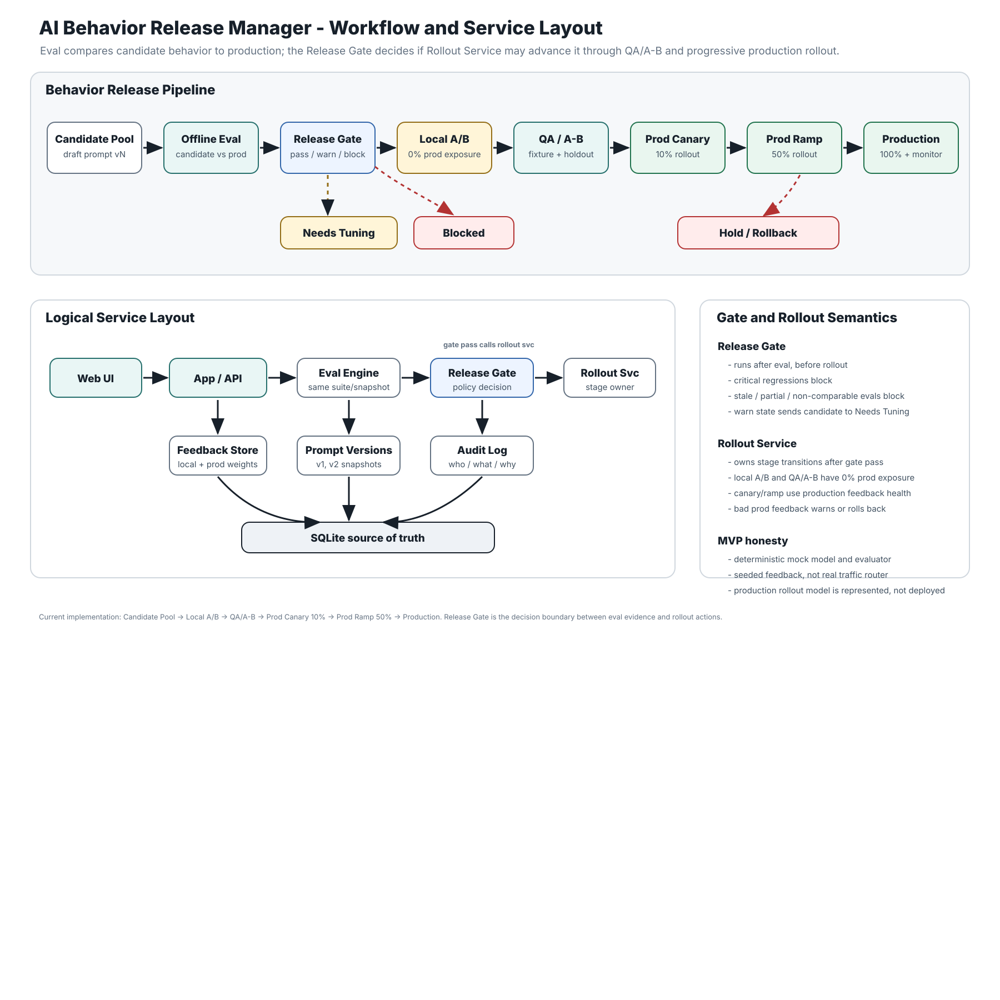

# AI Behavior Release Manager

One-day MVP for Luma take-home Problem 3: Managing Prompt & Model Behavior in Production.

This is a small release-management system for AI behavior changes. It lets a reviewer compare a candidate prompt/model configuration against current production, detect regressions, inspect a release gate, move the candidate through a CI/CD-style rollout pipeline, and review feedback signals plus audit history.

## Why This Exists

AI products ship behavior, not only code. Prompt, model, tool, retrieval, and guardrail changes can improve one use case while quietly regressing another. This app treats behavior changes like production releases:

```text
Create behavior version
-> run apples-to-apples eval comparison
-> detect regressions
-> review release gate
-> local A/B simulation
-> QA / A-B test environment
-> production canary and ramp
-> promote, rollback, or reject
-> inspect feedback and audit history
```

## Workflow Diagram

The service and release workflow are shown here:



The diagram captures the core implementation shape:

- Eval compares the candidate against the current production baseline.
- Release Gate decides `pass`, `warn`, or `block` from eval and feedback evidence.
- Passing candidates connect to Rollout Service for Local A/B, QA / A-B, canary, ramp, and production.
- Needs-tuning, blocked, rejected, hold, and rollback paths are explicit failure paths, not afterthoughts.

Diagram artifacts:

- SVG: `diagrams/ai_behavior_release_manager_workflow.svg`
- PNG: `diagrams/ai_behavior_release_manager_workflow.png`
- Excalidraw source: `diagrams/ai_behavior_release_manager_workflow.excalidraw`

## Run

Requires Python 3. No external packages or API keys are required.

```bash
python3 app.py
```

Open:

```text
http://127.0.0.1:8000
```

Optional:

```bash
PORT=8765 python3 app.py
BRM_DB_PATH=/tmp/brm.sqlite3 python3 app.py
```

## Test

```bash
python3 -m unittest discover tests
```

On some macOS sandboxed environments, Python may try to write bytecode outside the repo. If so:

```bash
PYTHONPYCACHEPREFIX=/tmp/brm_pycache python3 -m unittest discover tests
```

## Deliverables and Submit

This submission includes:

- working software that runs locally with Python 3
- `APPROACH.md` covering design decisions, tradeoffs, failure paths, and future work
- `video.md` for the Loom or Google Drive walkthrough link
- AI session history, collected by the provided submission packaging scripts

Before submitting, remove generated local state so reviewers start from deterministic seed data:

```bash
rm -rf behavior_release_manager/__pycache__
rm -f data/behavior_release_manager.sqlite3
```

Then run:

```bash
python3 -m unittest discover tests
./submit.sh --download-only
./submit.sh --skip-download
```

## Demo Flow

1. Open the dashboard.
2. Select `Candidate - Delight First`.
3. Run eval comparison.
4. See the gate block promotion because a critical refund-policy regression appears.
5. Select `Candidate - Warm Policy Guardrails`.
6. Run eval comparison.
7. See the gate pass and place the candidate on the release pipeline.
8. Advance it through `Local A/B Simulation`, `QA / A-B Test`, `Prod Canary 10%`, `Prod Ramp 50%`, and `Production`.
9. Use rollback from an active rollout stage, or reject the candidate from the release gate.
10. Inspect audit history, release evidence, and the approved prompt registry.

## Implementation Notes

- Python standard library HTTP server
- SQLite persistence
- deterministic mock model provider by default
- deterministic evaluator with must-include and must-not-include checks
- severity-weighted eval delta
- configurable feedback weights
- mixed-signal feedback penalty
- local release evidence index derived from raw eval and feedback data
- CI/CD-style behavior pipeline with local A/B, QA/A-B, canary, ramp, and production stages
- deterministic rollout health simulation and rollback audit events
- approved prompt registry mapping use case to the last proven production behavior
- transactional promotion invariant: exactly one production behavior version

## Important Files

- `app.py` - local web server
- `behavior_release_manager/db.py` - SQLite schema and connection helpers
- `behavior_release_manager/seed.py` - deterministic seed data
- `behavior_release_manager/services.py` - workflow and release invariants
- `behavior_release_manager/evaluator.py` - deterministic eval scoring
- `behavior_release_manager/release_gate.py` - feedback score and gate rules
- `behavior_release_manager/templates.py` - server-rendered HTML
- `static/app.css` - UI styling
- `tests/test_release_workflow.py` - release workflow tests
- `diagrams/ai_behavior_release_manager_workflow.svg` - workflow and service layout diagram
- `APPROACH.md` - decisions, tradeoffs, and failure modes
